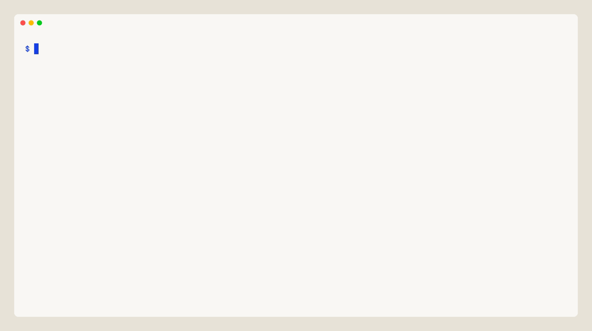
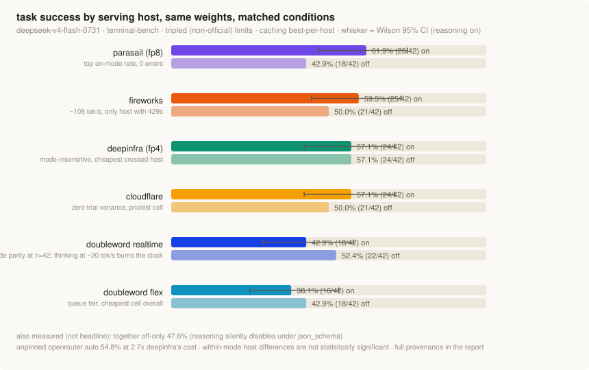
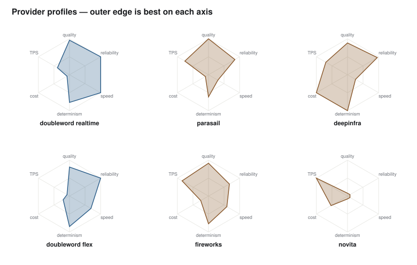

<div align="center">

# compound

**Backtest every model switch on your own traffic.**

Compound turns production traces into a standing answer to one question:
*can I move this workload to a cheaper model or a faster provider without losing quality?*
It replays candidates against your graded history, optimizes them until they clear your bar,
and hands you a verdict with a confidence interval, never a vibe.

`local-first` · `money-safe by default` · `statistically honest` · `Apache-2.0`

<br>



<sub>Same model, many hosts, one flag. Pick a benchmark and a task subset; every dry run is free.</sub>

</div>

---

## The problem

Every leaderboard tells you which model is best on average. None of them can tell you
whether the switch is safe on **your** workload, and the gap is not academic:

- **The serving host moves outcomes as much as the model does.** In our pinned-host
  terminal-bench sweep, identical open-model weights ranged from **0% to 55% end-to-end
  task success** purely from the serving layer: rate-limit kills, a missing API feature,
  a 5x latency spread. None of it is visible on a pricing page.
- **Evals rot.** Hand-written eval sets go stale the week after you write them, so most
  teams ship model switches on a demo and a prayer.
- **Experiments burn money invisibly.** One retry loop against a paid API and your
  evaluation budget is gone before the first honest number lands.

Routers pick the best of your options. Nobody proves your options on your traffic.

## What Compound does

One `compound.yaml`, one content-addressed cache, three layers:

| # | Layer | What happens |
|---|---|---|
| 1 | **Ingest** | Traces you already produce (Langfuse export, portable JSON) become redacted, provenance-typed eval cases with a sealed decision partition. No eval authoring. |
| 2 | **Backtest** | Any model x provider x quant replays against your graded corpus from the cache. Free assertions filter before judge tokens; re-deciding costs $0. |
| 3 | **Optimize** | The real [GEPA](https://github.com/gepa-ai/gepa) library evolves a cheaper candidate's prompt on train/val cases, never the sealed set. "No improvement" is a first-class outcome. |

## The payoff

```console
$ compound curate support
  84 traces -> 62 cases · sealed: 10 · train: 40 · val: 12

$ compound gate support --candidate kimi-k3 --reference opus-5 \
      --reason "quarterly cost review"
  reference  opus-5   task_success  0.94
  candidate  kimi-k3  task_success  0.93
  delta = -0.01   95% CI [-0.04, +0.02]   rule: max_regression 0.02

  VERDICT  MEETS GATE  (non-inferior at the declared bar)
  est. savings: $15.00 -> $0.14 /M out · re-decision from cache: $0
```

The gate emits one of five verdicts: **meets gate**, **fails**, **insufficient data**,
**judge abstained**, **no reliable improvement**. If the data cannot support a decision,
Compound says so instead of rounding noise up to a recommendation.

## Same weights, six hosts: what actually differs

> One model (`deepseek-v4-flash`), six pinned serving hosts, **terminal-bench**: 14 agentic
> terminal tasks x 3 identical trials per host, pass/fail decided by each task's own test
> suite inside a container — no LLM judge, no user simulator, temperature pinned by the
> agent. Then every failed episode's raw API traffic was audited to separate model
> failures from provider failures.

<picture>
  <source media="(prefers-color-scheme: dark)" srcset="assets/tb-results-dark.svg">
  
</picture>

- **Model quality is a tie; the serving layer is not.** Excluding provider-killed
  episodes, every functioning host lands at 45–57% — indistinguishable at this sample
  size. End-to-end, the spread is 0–55%, and the gap is entirely provider reliability.
- **fireworks lost 15 of 42 episodes to shared-pool rate limits** — its "degradation"
  across trials was weather, not the model. Its error-free trial scored right in the pack.
- **novita scored 0/42 with a perfectly healthy model**: its endpoint rejects the
  `json_schema` response format the agent needs on every turn. Invisible on single-turn
  benchmarks, fatal for agents — API capability coverage is a provider axis nobody prices.
- **Identical calls, 5x latency spread** (4.1s vs 21.2s median), and different
  determinism: one host flipped 2/14 task outcomes between identical trials, another 7/14.

<picture>
  <source media="(prefers-color-scheme: dark)" srcset="assets/tb-radar-dark.svg">
  
</picture>

<sub>cost and TPS axes come from the tau2 164-task run of the same model on the same
hosts; the other four axes are terminal-bench. novita's cost/TPS are excellent — its
collapse is a capability gap, not capacity.</sub>

Reproduce it (any model, your pick of hosts):

```bash
compound-bench providers deepseek/deepseek-v4-flash-0731     # discover pinnable hosts
compound-bench run terminal_bench \
    --model deepseek/deepseek-v4-flash-0731 \
    --providers openrouter/deepinfra,doubleword/realtime,doubleword/flex \
    --tasks fix-permissions,create-bucket --trials 3 --go    # dry run without --go
```

Since this run, the pinning proxy auto-retries 408/429/5xx with backoff and pins with
`require_parameters`, so both provider-failure classes above are absorbed or fail fast
at episode one. Any evaluation source that emits the
[row contract](src/compound/viz.py) also gets the frontier/speed HTML report via
`python -m compound.viz --rows rows.json`.

## Why it is easy

- **No eval set to write.** Your production traffic is the corpus; curation surfaces
  what needs review instead of asking you to author test cases.
- **Money-safe by default.** Without `--paid` nothing spends a cent: you get the cost
  estimate. Paid runs require an enabled budget, a hard USD limit, and a per-run `--cap`.
  Every completion is content-addressed and cached, so re-runs and re-decisions are $0.
- **Provider pinning is first-class.** `--openrouter-provider <slug>` isolates one
  serving host with fallbacks disabled, and the *served* host is verified on every call.
- **Your agent can drive it.** The repo ships a
  [`compound-backtest` skill](.claude/skills/compound-backtest/SKILL.md): any coding agent
  runs the loop under the same money rules you would.

## Honest by design

The parts most eval tools skip are the parts that make a verdict trustworthy:

- **A sealed decision partition.** Optimizers, prompt selection, and judge tuning never
  see it; opening it requires a stated `--reason`.
- **Pre-declared rules.** The non-inferiority bar is fixed and content-hashed before
  anyone looks at results; an optimized prompt is re-gated as a new declaration, never a
  quiet edit.
- **Calibration-gated judges.** An LLM judge feeds a gate only after out-agreeing human
  labels (Cohen's kappa with a bootstrap CI). Until then it abstains.
- **Intervals, never bare means.** Paired-bootstrap confidence bounds on every comparison.

## Quickstart

```bash
bun install
bun run packages/cli/src/main.ts import export.jsonl --importer langfuse  # or --importer json
bun run packages/cli/src/main.ts curate <task-key>
bun run packages/cli/src/main.ts experiment <task-key> <model>            # dry run, $0
bun run packages/cli/src/main.ts experiment <task-key> <model> --paid --cap 2.00
bun run packages/cli/src/main.ts gate <task-key> --candidate M --reference M --reason "..."
bun run packages/cli/src/main.ts view compare <task-key>                  # cost/latency/TPS/quality per route
bun run packages/cli/src/main.ts serve                                    # local API on 127.0.0.1:4319
cd packages/dashboard && bun run dev                                      # dashboard on localhost:3000
```

Everything runs locally with no account: SQLite storage, your keys in `.env`
(git-ignored), your traces never leave your machine.

```env
OPENROUTER_API_KEY=
DOUBLEWORD_API_KEY=
```

## The benchmark engine (Python)

`src/compound/` holds the machinery behind our published numbers: pinned-host provider
sweeps and GEPA prompt optimization over live interactive benchmark episodes, with the
same sealed-partition and budget-cap discipline as the product.

```bash
uv sync --extra dev
uv run compound validate-config && uv run pytest -q

# provider sweep: one model, many pinned hosts, full tau-bench protocol
PYTHONPATH=src python -m compound.tau_sweep --estimate     # free cost sheet
PYTHONPATH=src python -m compound.tau_sweep --run          # spends within declared caps

# GEPA: evolve an agent instruction on train/val, one-shot gate on the sealed set
PYTHONPATH=src python -m compound.tau_gepa --estimate
```

### The benchmark library

One front door runs any task subset from any shipped benchmark, and `run` is a
dry run unless you add `--go`:

| Benchmark | What it measures | How it grades |
|---|---|---|
| `tau2` | interactive tool-calling support (airline/retail/telecom) | live user simulator + official reward |
| `bfcl` | single-turn function-call generation | official AST checker |
| `ds1000` | data-science code generation | official tests in a pinned container |
| `mmlu` | multiple-choice knowledge, 57 subjects | exact letter match, no judge |
| `terminal_bench` | agentic terminal tasks | official harness in Docker |

`uv sync --extra dev` installs a `compound-bench` command; every example below
uses it (or run the module directly with `PYTHONPATH=src python -m compound.bench`).

```bash
compound-bench list
compound-bench tasks tau2 --contains retail
compound-bench run tau2 --model zai-org/GLM-5.2-FP8 --tasks retail:10,airline:3 --go
```

Each benchmark that needs an engine or a fetched dataset has a one-time
`prepare` step, so a fresh clone can run any of them:

```bash
compound-bench prepare tau2            # clones + installs sierra-research/tau2-bench
compound-bench prepare mmlu            # samples cais/mmlu
compound-bench prepare terminal_bench  # needs the dataset downloaded
compound-bench run mmlu --model deepseek/deepseek-v4-flash-0731 \
    --partition decision_test --go
```

`prepare tau2` installs the public tau2-bench into the current environment; a
`run tau2 --go` without it stops with a pointer instead of an import error. Dry
runs (no `--go`) preview the plan without it.

Any OpenAI-compatible host can serve the model — vLLM, Fireworks direct, Groq,
your own box — no adapter code required:

```bash
compound-bench run tau2 --model my-model \
    --provider myhost --api-base http://localhost:8000/v1 --api-key-env MYHOST_API_KEY
```

The same fields (`provider`, `api_base`, `api_key_env`) work per-config in sweep
specs, so a custom host can sit in the same frontier chart as the pinned
OpenRouter routes. Adding a benchmark is one registry entry backed by a
partitioned manifest; see
[#33](https://github.com/aktasbatuhan/compound/issues/33) for the adapter
interface.

### Same model, many hosts: `--providers`

The point of Compound is the switch decision, and that decision turns on the
fact that **the same model is not the same product on every host**. So picking
hosts is one flag. Drop in your keys, name the providers, pick a benchmark and a
task subset, and get a per-host cost / latency / quality table with charts.

A **provider token** names where a model is served, independent of the model:

| Token | Meaning |
|---|---|
| `openrouter/<upstream>` | pin one OpenRouter upstream, fallbacks off (`openrouter/deepinfra`, `openrouter/baseten/fp8`) |
| `doubleword/<tier>` | Doubleword, `realtime` or `flex` |
| `direct/<name>` | any OpenAI-compatible host from `compound.yaml` `providers.<name>` |

You do not have to know the upstream slugs. `providers <model>` reads them off
OpenRouter and prints paste-ready tokens with quant, context, price, and whether
each host is up:

```bash
compound-bench providers deepseek/deepseek-v4-flash-0731
# PROVIDER TOKEN              QUANT   CONTEXT   $IN/M  $OUT/M  STATUS
# openrouter/deepinfra/fp4    fp4        1.0M  $0.090  $0.180  up
# openrouter/baseten/fp8      fp8        1.0M  $0.130  $0.260  up
# openrouter/deepseek/fp8     fp8        1.0M  $0.140  $0.280  up
# ...
# sweep the ones that are up:
#   --providers openrouter/deepinfra/fp4,openrouter/baseten/fp8,openrouter/deepseek/fp8,...
```

```bash
# tau2 across five hosts of one model, 3 trials, the same 14 tasks (dry run drops --go)
compound-bench run tau2 \
    --model deepseek/deepseek-v4-flash-0731 \
    --providers openrouter/deepinfra/fp4,openrouter/baseten/fp8,openrouter/deepseek/fp8,doubleword/realtime,doubleword/flex \
    --tasks airline:6,retail:20 --trials 3 --max-tokens 8192 \
    --output artifacts/dsflash --go

# one report: per-host accuracy, cost/task, latency, TPS, and which upstream actually served
PYTHONPATH=src python -m compound.bench_report artifacts/dsflash \
    --prices doubleword-flex=0.70,2.25 --prices doubleword-realtime=0.93,3.00
# -> artifacts/dsflash/report/{summary.json,episodes.csv,per_task.csv,transcripts.jsonl,charts.html}
```

A `--go` run checks up front that every credential the chosen hosts need is
present, and stops naming the missing one before it spends a cent.

Cost comes from OpenRouter's own per-call accounting where present, and from the
declared `--prices` you pass for hosts that do not report it; the report also
records the upstream each episode was **actually** served by, so a pinned run can
be checked, not trusted.

**Agentic harnesses too.** Third-party harnesses (terminal-bench) build their own
model calls and cannot pin an OpenRouter upstream. `compound.orproxy` fixes that:
a localhost OpenAI-compatible proxy that stamps the pinning into every request,
so the same `--providers` list works there with only your OpenRouter key.

```bash
compound-bench run terminal_bench \
    --model deepseek/deepseek-v4-flash-0731 \
    --providers openrouter/deepinfra/fp4,doubleword/flex \
    --tasks hello-world --go        # needs Docker; each host runs behind its own proxy
```

## Mission

Inference is becoming a market: every open model ships on ten hosts within weeks, at
different speeds, prices, and quantizations, and the spread changes monthly. Teams that
treat "which model, which host, which prompt" as a one-time choice overpay and under-serve.

Compound's mission is to make that choice **a measured, repeatable decision on your own
traffic**: backtested like a trading strategy, gated like a deployment, and eventually
automated like both, with a stop-loss. The proof is ambient; the switch is earned.

## Status

Everything above works today and is tested end to end (`bun test`, `uv run pytest`).
What comes next — live verification, automated switching, the continuous loop — is
tracked in the [issues](https://github.com/aktasbatuhan/compound/issues). Expect sharp
edges; expect honest verdicts.

## License

[Apache-2.0](LICENSE)
